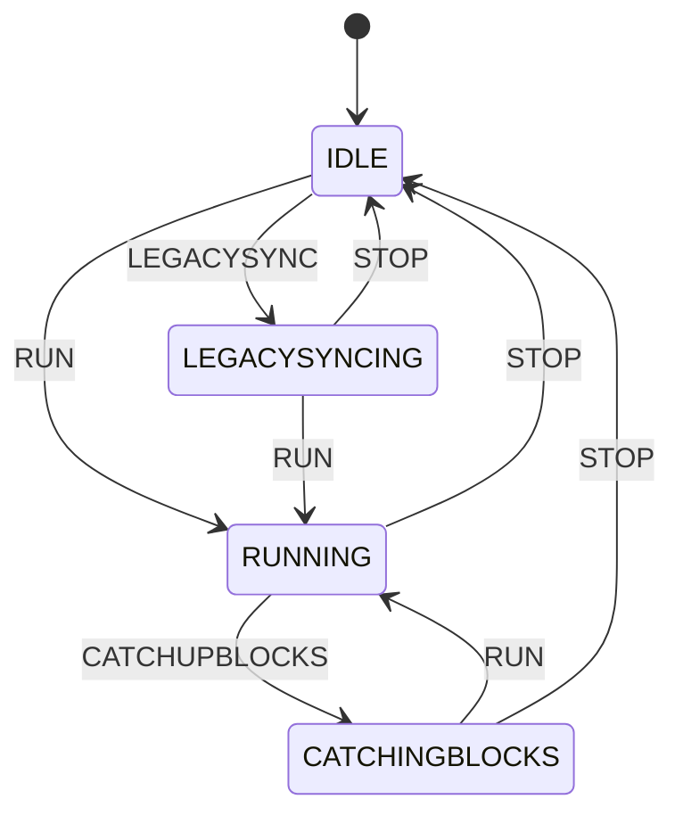

# State Machine

The mermaid diagram outlined below represents the various states and events that dictate the functionality of the node.

## Interactive Diagram

## Alternative Views

If the diagram above doesn't render properly, you can view it using these alternatives:

- **[View in Mermaid.live](https://mermaid.live/edit#pako:eNqNUUtvgkAQ_itkjg0QoTzn0MSuxpoSNEUPtvSwKSuaCJh1adoS_7vL0paoadI5zTffYyaZBt6qjAHCQVDBRluac1oY73ZaarJebl41w7jTpqNo3E3IcEEepvHkPpqRx0SRT8s4lhNsmz9FbQJqyWI27yQtVkQ0ngzJKlnFRGX08EJ3veXM-W_N5SHfHsWd340dXs47eC3vo0CHnG8zQMFrpkPBeEFbCE3rSkFsWMFSQNlmbE3rnUghLY_Stqflc1UVP05e1fkGcE13B4nqfdY_5VfCyoxxUtWlALQsFQHYwAegH9jmret6VhjYwcDyHR0-AT3HDGV5nms5oWcH4VGHL7VzYAa-ezwBKDKO3w)** - Edit and customize the diagram interactively
- **Static image**: 
