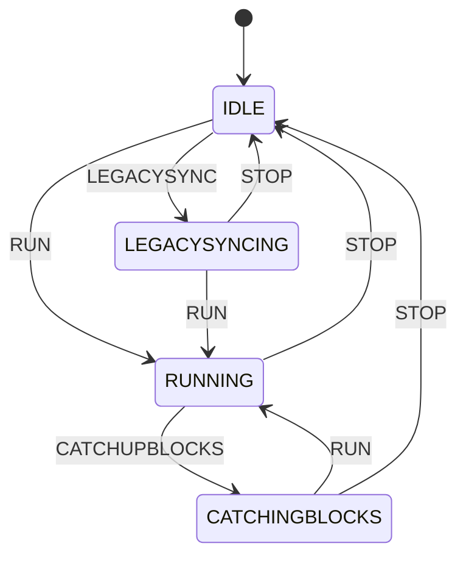

# State Machine

The mermaid diagram outlined below represents the various states and events that dictate the functionality of the node.

## Interactive Diagram

```mermaid
stateDiagram-v2
    [*] --> IDLE
    CATCHINGBLOCKS --> RUNNING: RUN
    CATCHINGBLOCKS --> IDLE: STOP
    IDLE --> LEGACYSYNCING: LEGACYSYNC
    IDLE --> RUNNING: RUN
    LEGACYSYNCING --> RUNNING: RUN
    LEGACYSYNCING --> IDLE: STOP
    RUNNING --> CATCHINGBLOCKS: CATCHUPBLOCKS
    RUNNING --> IDLE: STOP
```
